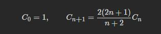

# 动态规划

本题也是一个比较复杂的动态规划，主要还是递推公式不太好找。必须要观察每一个数时对应二叉树的规律来总结规律。

比如上面n=3时，实际上可以从顶部节点来考虑。即分3种情况：

- 顶部节点为1
- 顶部节点为2
- 顶部节点为3

可以看到，顶部节点为1时，其左子树的分布规律就等于n=0时的情况；右子树的分布规律就等于n=2时的情况。所以顶部节点为1时，`nums1 = dp[0] *dp[2]`

同理，顶部节点为2时，`nums2 = dp[1] *dp[1]`

顶部节点为3时，`nums2 = dp[2] *dp[0]`

则，综上：

`dp[3] = dp[0] *dp[2] + dp[1] *dp[1] + dp[2] *dp[0]`。

`dp[i] += dp[j - 1] * dp[i - j]`

j-1 为j为头结点左子树节点数量，i-j 为以j为头结点右子树节点数量

# 数学方法

另外，本题还有一种数学方法，即本题的递推公式本身就是一个著名的数列：**明安图-卡塔兰数**。

其可以直接通过上一次的结果来计算本次结果，公式如下：

相似的问题还有：

- 一个栈([无穷大](https://baike.baidu.com/item/无穷大))的进栈序列为1,2,3,..n,有多少个不同的出栈序列?

  ### 关于这个问题的5种变型

  **(2).找零钱（找一半）**

  有2n个人排成一行进入剧场。入场费5元。其中只有n个人有一张5元钞票，另外n人只有10元钞票，剧院无其它钞票，问有多少种方法使得只要有10元的人买票，售票处就有5元的钞票找零？

  **(3).三角网格**

  

  形如这样的直角三角形网格，从左上角开始，只能向右走和向下走，问总共有多少种走法？

  **(4).括号排列**

  矩阵连乘：

  

   ，共有（n+1）项，依据[乘法结合律](https://baike.baidu.com/item/乘法结合律)，不改变其顺序，只用括号表示成对的乘积，试问有几种括号化的方案？或者说：有n对括号，可以并列或嵌套排列，共有多少种情况？

  **(5).球盒问题**

  球分两种颜色，黑色和白色分别各有n只，盒子数量和球的个数相同，每个盒子里面只能放一只球，并且必须满足如下限制,即每一个白球必须和一只黑球配对（白球在黑球前，**允许嵌套**）。

  例.用0表示白球，1表示黑球，则：

  0011，010101，001011合法。

  1100，101010，010110不合法。

  **(6).最适合理解的模型**

  n个0和n个1组成一个2n位的2进制数，要求从左到右扫描时，1的累计数始终都**小于等于**0的累计数，求满足条件的数有多少？

具体参考下面的[链接](https://baike.baidu.com/item/catalan/7605685?fr=aladdin)